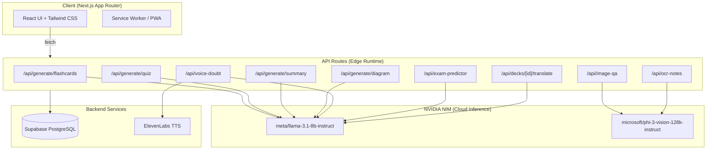

# EduCard AI

[](https://build.nvidia.com/)
[](https://nextjs.org/)
[](https://supabase.com/)

**Turn Any Content Into Flashcards & Quizzes Instantly**

EduCard AI is an AI-powered study platform that transforms YouTube videos, PDFs, and images into smart flashcards, quizzes, summaries, and more. Built with Next.js, **NVIDIA NIM** inference microservices, and Supabase.

> **Powered by NVIDIA NIM** — All AI inference runs through NVIDIA NIM API endpoints, leveraging Meta Llama 3.1 8B Instruct for text generation and Microsoft Phi-3 Vision for image understanding.

---

## Architecture



---

## Features

### Core
- **YouTube to Flashcards** — Paste a YouTube URL, AI extracts the transcript and generates flashcards & quizzes
- **PDF to Study Material** — Upload any PDF and get AI-generated flashcards, quizzes, and summaries
- **AI-Powered Quizzes** — Auto-generated multiple-choice quizzes with explanations and scoring
- **Smart Spaced Repetition** — SM-2 algorithm schedules reviews for optimal retention
- **Progress Analytics** — Track study streaks, quiz scores, and learning progress

### AI-Powered Tools
- **Voice Doubt Solver** — Ask questions by voice, get AI answers with text-to-speech playback
- **Image Q&A** — Upload an image and ask questions about it using NVIDIA NIM Vision
- **Exam Predictor** — Upload past papers, AI predicts likely exam questions and generates practice sets
- **Handwriting OCR** — Extract text from handwritten notes using NVIDIA NIM Vision
- **AI Diagrams** — Generate visual Mermaid.js diagrams for any concept
- **Multilingual Translation** — Translate flashcard decks into 20+ languages
- **Weak Topic Tracker** — Identifies weak areas based on quiz performance

### Platform
- **Dark/Light Theme** — Full theme support with system preference detection
- **PWA Support** — Installable progressive web app with offline capabilities
- **Public Deck Sharing** — Share any deck via a public link
- **Export to CSV** — Download flashcards for use in other apps
- **Keyboard Shortcuts** — Quick navigation in study and quiz modes
- **Cookie Consent** — GDPR-compliant cookie banner
- **SEO Optimized** — Full OpenGraph, Twitter Card, and structured metadata

---

## Tech Stack

| Layer | Technology |
|-------|-----------|
| **Framework** | Next.js 14 (App Router) |
| **Language** | TypeScript |
| **Styling** | Tailwind CSS + shadcn/ui |
| **AI (Text)** | NVIDIA NIM — `meta/llama-3.1-8b-instruct` |
| **AI (Vision)** | NVIDIA NIM — `microsoft/phi-3-vision-128k-instruct` |
| **Voice TTS** | ElevenLabs (with browser SpeechSynthesis fallback) |
| **Voice STT** | Browser SpeechRecognition API |
| **Database** | Supabase (PostgreSQL) |
| **Auth** | Supabase Auth |
| **Storage** | Supabase Storage |
| **PDF Parsing** | unpdf (edge-compatible) |
| **Deployment** | Cloudflare Pages |

---

## Getting Started

### Prerequisites

- Node.js 18+
- npm or yarn
- A [Supabase](https://supabase.com) project
- An [NVIDIA NIM](https://build.nvidia.com/) API key
- An [ElevenLabs](https://elevenlabs.io) API key (optional, for voice)

### 1. Clone the repository

```bash
git clone https://github.com/mahipal1008/educard-ai.git
cd educard-ai
```

### 2. Install dependencies

```bash
npm install
```

### 3. Set up environment variables

Create a `.env.local` file in the root directory:

```env
# Supabase
NEXT_PUBLIC_SUPABASE_URL=https://your-project.supabase.co
NEXT_PUBLIC_SUPABASE_ANON_KEY=your-anon-key
SUPABASE_SERVICE_ROLE_KEY=your-service-role-key

# NVIDIA NIM API
NVIDIA_API_KEY=nvapi-your-key-here
NVIDIA_NIM_BASE_URL=https://integrate.api.nvidia.com/v1
NVIDIA_NIM_MODEL=meta/llama-3.1-8b-instruct
NVIDIA_NIM_VISION_MODEL=microsoft/phi-3-vision-128k-instruct

# ElevenLabs TTS (optional)
ELEVENLABS_API_KEY=your-elevenlabs-key
ELEVENLABS_VOICE_ID=21m00Tcm4TlvDq8ikWAM

# App
NEXT_PUBLIC_APP_URL=http://localhost:3000
```

### 4. Set up the database

Run the SQL migration in your Supabase Dashboard SQL Editor:

```
supabase/FULL_MIGRATION.sql
```

This creates 8 tables, RLS policies, triggers, and a storage bucket.

### 5. Run the development server

```bash
npm run dev
```

Open [http://localhost:3000](http://localhost:3000) in your browser.

---

## Database Schema

| Table | Purpose |
|-------|---------|
| `profiles` | User profiles (extends Supabase auth) |
| `documents` | YouTube/PDF sources submitted by users |
| `decks` | Flashcard decks linked to documents |
| `flashcards` | Individual flashcard front/back pairs |
| `quizzes` | Quiz metadata linked to documents |
| `quiz_questions` | MCQ questions with options and explanations |
| `quiz_attempts` | User quiz scores and answer history |
| `study_progress` | Per-card spaced repetition state (SM-2) |

All tables have Row Level Security (RLS) enabled. Triggers auto-create profiles on signup and maintain card counts.

---

## Project Structure

```
educard-ai/
├── app/
│   ├── (auth)/          # Login & signup pages
│   ├── (dashboard)/     # Authenticated pages (dashboard, library, study, quiz, etc.)
│   ├── (public)/        # Public pages (landing, about, blog, pricing, etc.)
│   ├── api/             # 26 API routes (all edge runtime)
│   └── layout.tsx       # Root layout with SEO metadata
├── components/
│   ├── landing/         # Landing page sections (Hero, Features, Demo, Team, etc.)
│   ├── layout/          # Navbar, Footer
│   ├── dashboard/       # Dashboard widgets
│   ├── create/          # Content creation forms
│   └── ui/              # shadcn/ui components
├── lib/
│   ├── nvidia-nim.ts    # NVIDIA NIM API client (text + vision)
│   ├── services/        # AI generation service, PDF extraction, storage
│   ├── supabase/        # Supabase client & server utilities
│   └── claude-vision.ts # NIM vision (image Q&A, OCR, diagrams)
├── hooks/               # Custom React hooks
├── supabase/
│   ├── migrations/      # Individual SQL migrations
│   └── FULL_MIGRATION.sql  # Combined migration file
└── wrangler.toml        # Cloudflare Pages config
```

---

## API Routes

All API routes use the Edge runtime for Cloudflare compatibility. All AI calls go through NVIDIA NIM.

| Endpoint | Method | Description | NIM Model |
|----------|--------|-------------|-----------|
| `/api/process/youtube` | POST | Process YouTube URL into transcript | — |
| `/api/process/pdf` | POST | Upload & process PDF | — |
| `/api/generate/flashcards` | POST | Generate flashcards from content | Llama 3.1 8B |
| `/api/generate/quiz` | POST | Generate quiz from content | Llama 3.1 8B |
| `/api/generate/summary` | POST | Generate summary from content | Llama 3.1 8B |
| `/api/generate/diagram` | POST | Generate Mermaid.js diagrams | Llama 3.1 8B |
| `/api/voice-doubt` | POST | Voice doubt solver (NIM + ElevenLabs) | Llama 3.1 8B |
| `/api/exam-predictor` | POST | Predict exam questions from past papers | Llama 3.1 8B |
| `/api/image-qa` | POST | Image-based Q&A | Phi-3 Vision |
| `/api/ocr-notes` | POST | Handwriting OCR | Phi-3 Vision |
| `/api/decks/[id]/translate` | POST | Translate deck to another language | Llama 3.1 8B |
| `/api/decks/smart-study` | GET | Get cards due for spaced repetition | — |
| `/api/user/weak-topics` | GET | Get weak topic analysis | — |

---

## Deployment (Cloudflare Pages)

1. Push to GitHub
2. Go to **Cloudflare Dashboard > Pages > Create project > Connect to Git**
3. Select the `educard-ai` repository
4. Build settings:
   - **Framework preset:** Next.js
   - **Build command:** `npx @cloudflare/next-on-pages`
   - **Build output directory:** `.vercel/output/static`
5. Add all environment variables from `.env.local`
6. Deploy

---

## Pages

| Route | Description |
|-------|-------------|
| `/` | Landing page with hero, features, demo, team, testimonials, pricing |
| `/about` | About EduCard AI |
| `/blog` | Engineering blog |
| `/contact` | Contact form |
| `/pricing` | Free / Pro / Teams pricing tiers |
| `/privacy` | Privacy policy |
| `/terms` | Terms of service |
| `/login` | User login |
| `/signup` | User registration |
| `/dashboard` | Main dashboard with stats, recent docs, quick actions |
| `/create` | Upload YouTube URL or PDF |
| `/library` | Document library with search & filters |
| `/deck/[id]` | View flashcard deck |
| `/deck/[id]/study` | Spaced repetition study session |
| `/quiz/[id]` | Take a quiz |
| `/exam-predictor` | AI exam prediction tool |
| `/settings` | User settings |

---

## License

This project is proprietary. All rights reserved.

---

## Author

**Mahipal** — [GitHub](https://github.com/mahipal1008)

---

Built with [NVIDIA NIM](https://build.nvidia.com/), ElevenLabs, and Supabase.
